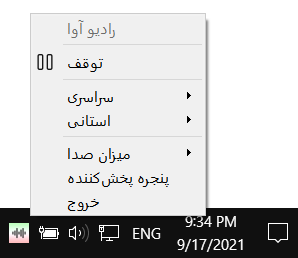

# ایران رادیو

برنامه دسکتاپ پخش زنده شبکه‌های رادیویی ایران.

این برنامه نسخه غیررسمی [ایران صدا][1] است و از API های ایران صدا استفاده می‌کند.

## دانلود برنامه

* [Windows x64][3]

تمامی نسخه‌های ایران رادیو در [صفحه دانلود برنامه][3] در دسترس هستند.
    
## تصاویر برنامه

    

    
## License

برنامه ایران رادیو تحت گواهی [GNU General Public License v3.0][2] منتشر شده است.
    

[1]: http://iranseda.ir/
[2]: https://github.com/AmirMahmood/IranRadio/blob/main/LICENSE  
[3]: https://github.com/AmirMahmood/IranRadio/releases/download/v0.8.0/IranRadio-x64-v0.8.0.exe

