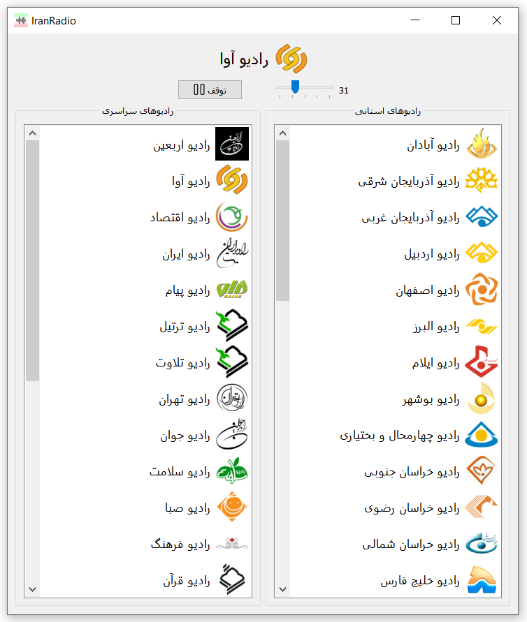

# ایران رادیو

برنامه دسکتاپ پخش زنده شبکه‌های رادیویی ایران.

این برنامه نسخه غیررسمی [ایران صدا][1] است و از API های ایران صدا استفاده می‌کند.

    
## تصاویر برنامه

    

    
## License

برنامه ایران رادیو تحت گواهی [GNU General Public License v3.0][2] منتشر شده است.
    

[1]: http://iranseda.ir/
[2]: https://github.com/AmirMahmood/IranRadio/blob/main/LICENSE

